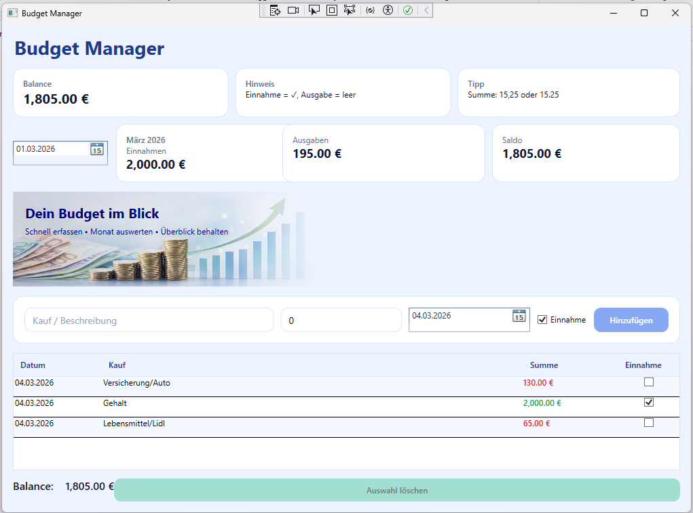
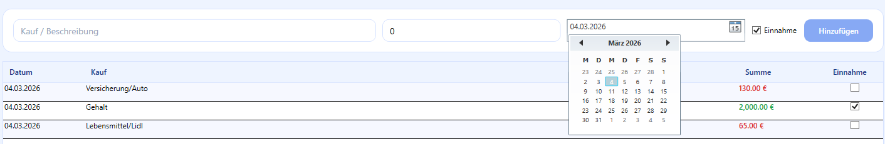
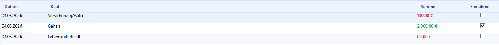
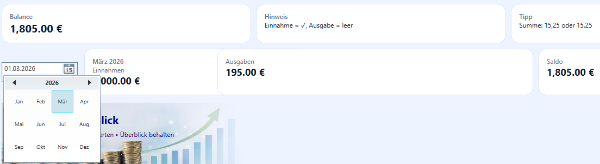

# BudgetManager

[](https://github.com/mila25-25/BudgetManager/actions)


WPF desktop application for managing personal income and expenses.

---

## Overview

BudgetManager is a desktop application for managing personal finances.
It allows users to track income and expenses, calculate balances and analyze transactions.

The application is built with **WPF** using the **MVVM architecture** and uses **Entity Framework Core with SQLite** for data persistence.

---

## Table of Contents

- [Overview](#overview)
- [Features](#features)
- [Technologies](#technologies)
- [Database](#database)
- [How to Run](#how-to-run)
- [Screenshots](#screenshots)
- [Architecture](#architecture)
- [UML Diagrams](#uml-diagrams)

---

## Features

- Add transactions (income / expense)
- Delete transactions
- View transaction list
- Monthly report (income & expenses)
- Automatic balance calculation
- Unit tests for service layer

---

## Technologies

- C#
- .NET
- WPF
- MVVM
- Entity Framework Core
- SQLite
- xUnit
- GitHub Actions (CI)
- PlantUML

---

## Database

The application uses a local **SQLite database**.

The database is created automatically when the application starts using **Entity Framework Core**.

The database file is stored locally and is not included in the repository.

---

## How to Run

1. Clone the repository

git clone https://github.com/mila25-25/BudgetManager

2. Open the solution in Visual Studio

BudgetManager.sln

3. Restore NuGet packages

4. Run the application

The database will be created automatically.

---

## Screenshots

### Dashboard



### Transactions



### Add Transaction



### Monthly Overview



---

## Architecture
BudgetManager uses a simple **layered architecture**:
```text
BudgetManager/

UI (Views)
↓
ViewModels
↓
Services (Business Logic)
↓
Models (Data)
```
Unit tests validate the service layer. 

---

## Project Structure
```text
BudgetManager/
│
├── BudgetManager/          # Main WPF application
│   ├── Models/             # Data models
│   ├── Services/           # Business logic
│   ├── ViewModels/         # MVVM ViewModels
│   ├── Views/              # WPF UI
│   ├── Data/               # Database context
│   └── Migrations/         # Entity Framework migrations
│
├── BudgetManager.Tests/    # Unit tests
│
├── docs/
│   ├── screenshots/        # UI screenshots
│   └── uml/                # UML diagrams
│
└── README.md
```
---

## UML Diagrams

### Use Case Diagram


### Class Diagram


### Database ER Model


### Activity Diagram – Add Transaction


---

## Future Improvements

Possible extensions of the application include:

- Transaction categories
- Graphical financial statistics
- Export functionality (CSV / PDF)
- Multi-user support
- Cloud synchronization
- Mobile or web version

The current architecture (MVVM + Service Layer) allows these features
to be implemented without major structural changes.

## Author

Created by **Ludmila Hoshko**
