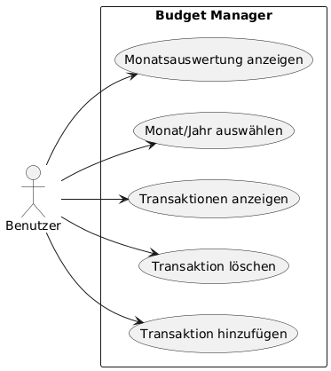
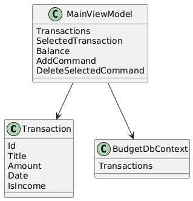
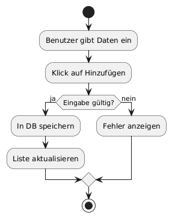
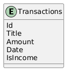

## 4. UML- und Datenbankdiagramme – Analyse und Entwurf

Zur strukturierten Planung und Dokumentation der Anwendung wurden mehrere Diagramme erstellt.
Diese Diagramme unterstützen das Verständnis der Anforderungen, der Systemarchitektur sowie der
zentralen Abläufe innerhalb der Anwendung.

Alle Diagramme befinden sich im Repository im Ordner `docs/uml/`.

---

### 4.1 Use-Case-Diagramm

Das Use-Case-Diagramm stellt die Anwendung aus Sicht des Benutzers dar.
Es zeigt, welche Funktionen dem Benutzer zur Verfügung stehen und wie er mit dem System interagiert.

Der Benutzer kann:
- Transaktionen (Einnahmen und Ausgaben) hinzufügen
- Transaktionen löschen
- Alle Transaktionen anzeigen
- Monat und Jahr auswählen
- Eine Monatsauswertung (Einnahmen, Ausgaben, Saldo) anzeigen

Das Diagramm verdeutlicht, dass alle Kernfunktionen direkt vom Benutzer ausgelöst werden
und bildet die Grundlage für die funktionalen Anforderungen der Anwendung.

---

### 4.2 Klassendiagramm

Das Klassendiagramm beschreibt die statische Struktur der Anwendung und zeigt die wichtigsten Klassen
sowie deren Beziehungen untereinander.

Zentrale Klassen sind:
- **Transaction** (Model): Repräsentiert eine einzelne Einnahme oder Ausgabe.
- **MainViewModel** (ViewModel): Enthält die Geschäftslogik, berechnete Werte (Balance, Monatsauswertung)
  sowie die Commands zur Verarbeitung von Benutzeraktionen.
- **BudgetDbContext**: Stellt die Verbindung zur SQLite-Datenbank her und verwaltet die Persistenz
  über Entity Framework Core.

Zusätzlich verwendet das ViewModel Commands (z. B. `AddCommand`, `DeleteSelectedCommand`),
um Benutzerinteraktionen aus der View gemäß dem MVVM-Pattern zu verarbeiten.

Das Diagramm verdeutlicht die Umsetzung der MVVM-Architektur und die klare Trennung zwischen
Datenmodell, Anwendungslogik und Datenhaltung.

---

### 4.3 Aktivitätsdiagramm – „Transaktion hinzufügen“

Das Aktivitätsdiagramm beschreibt den Ablauf beim Hinzufügen einer neuen Transaktion.

Der Prozess beginnt mit der Eingabe der Daten durch den Benutzer und endet mit der Aktualisierung
der Benutzeroberfläche. Wichtige Schritte sind:
- Eingabe der Transaktionsdaten
- Validierung der Eingaben
- Speicherung der Daten in der Datenbank
- Aktualisierung der Liste sowie der Berechnungen (Balance, Monatswerte)

Dieses Diagramm stellt den Kontrollfluss dar und erleichtert das Verständnis der im ViewModel
implementierten Logik.

---

### 4.4 Datenbankmodell (ER-Modell)

Das Datenbankmodell wird durch ein Entity-Relationship-Diagramm (ER-Modell) beschrieben.
Die Anwendung verwendet eine SQLite-Datenbank mit einer zentralen Tabelle **Transactions**.

Die Tabelle enthält folgende Attribute:
- **Id**: Primärschlüssel
- **Title**: Beschreibung der Transaktion
- **Amount**: Betrag
- **Date**: Datum der Transaktion
- **IsIncome**: Kennzeichnung für Einnahme oder Ausgabe

Das Datenbankmodell ist bewusst einfach gehalten und ermöglicht eine effiziente Speicherung
sowie Auswertung der Finanzdaten. Es ist zudem leicht erweiterbar, z. B. um Kategorien oder Benutzer.

---

### 4.5 Zusammenfassung

Die Diagramme unterstützen die strukturierte Entwicklung der Anwendung und stellen sicher,
dass Anforderungen, Architektur und Implementierung konsistent aufeinander abgestimmt sind.
Sie tragen wesentlich zur Verständlichkeit, Wartbarkeit und Erweiterbarkeit des Projekts bei.

---

## 7. Innovation und Erweiterbarkeit

Die entwickelte Anwendung **BudgetManager** geht über eine einfache CRUD-Anwendung hinaus
und bietet mehrere innovative sowie benutzerfreundliche Ansätze.

### 7.1 Benutzerfreundlichkeit

- Klare, moderne GUI mit übersichtlicher Struktur (Dashboard, Banner, Formulare, Tabelle)
- Direkte visuelle Rückmeldung bei Eingaben und Aktionen
- Intuitive Monats- und Jahresauswahl zur schnellen Auswertung der Finanzdaten
- Unterstützung verschiedener Zahlenformate (z. B. 15,25 und 15.25)

Die Anwendung ist auch für technisch unerfahrene Benutzer leicht verständlich und erfordert
keine besondere Einarbeitung.

### 7.2 Funktionale Erweiterbarkeit

Die verwendete MVVM-Architektur ermöglicht eine einfache Erweiterung der Anwendung, z. B. um:
- Kategorien für Einnahmen und Ausgaben
- Grafische Auswertungen (Diagramme pro Monat/Jahr)
- Exportfunktionen (CSV, PDF)
- Mehrbenutzerfähigkeit
- Mehrsprachige Benutzeroberfläche

Diese Erweiterungen können ohne grundlegende Änderungen an der bestehenden Struktur ergänzt werden.

### 7.3 Technische Innovation

- Konsequente Nutzung des MVVM-Patterns zur Trennung von Logik und UI
- Einsatz von Entity Framework Core mit SQLite für lokale Persistenz
- Asynchrone Datenzugriffe zur Vermeidung von UI-Blockierungen
- Dynamische Berechnung von Balance und Monatsauswertungen in Echtzeit

### 7.4 Zukunftspotenzial

Die Anwendung eignet sich als Grundlage für:
- Persönliche Haushaltsbuchführung
- Studenten- oder Kleinunternehmer-Finanzverwaltung
- Erweiterung zu einer webbasierten Lösung

Durch die klare Struktur und ausführliche Dokumentation ist das Projekt nachhaltig wartbar
und gut ausbaufähig.
